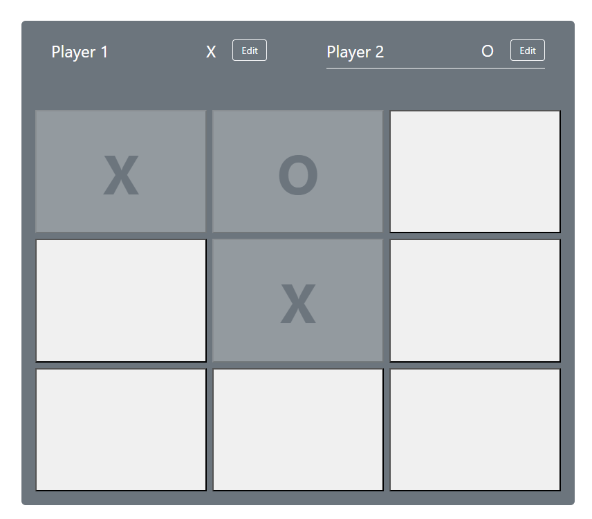

# Tic Tac Toe Game with React

This is a simple Tic-Tac-Toe game built with React and styled using Bootstrap. It was developed as part of a course I am taking on React and Next.js in Udemy, with additional tweaks and customizations. This project was bootstrapped with [Create React App](https://github.com/facebook/create-react-app).

## Features

* Two-Player Mode: Play against another person by taking turns.
* Turn Indicator: The game tracks and displays whose turn it is.
* Winning Condition: The game detects and announces the winner in a modal when three matching symbols are aligned horizontally, vertically, or diagonally.
* Draw Condition: If all cells are filled without a winner, the game declares a draw and shows a modal.

### Installation

1. Clone the repository: git clone https://github.com/romy47/react_tic_tac_toe.git.
2. Navigate to the project directory.
3. Install dependency: npm install.
4. Start the development server: npm start.
5. Play: Open your browser and go to http://localhost:3000 to play the game.

### Technologies Used

React and Bootstrap.
